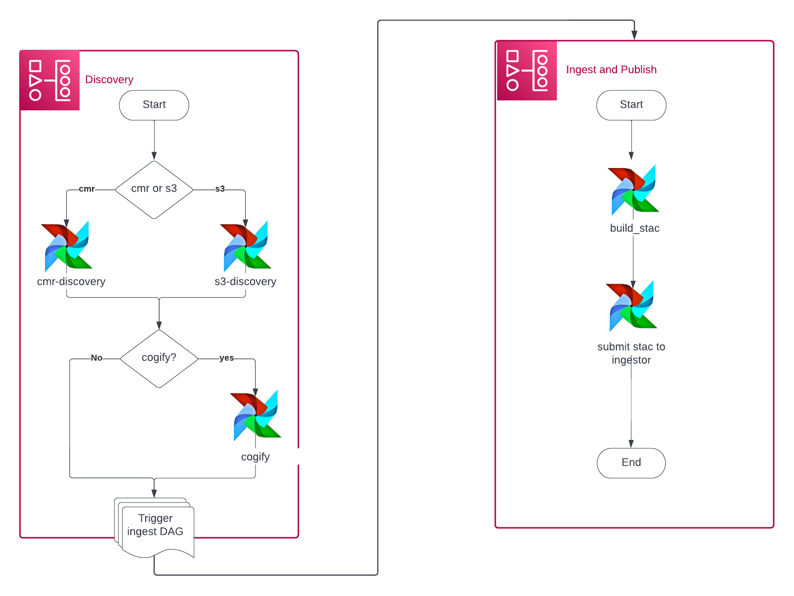
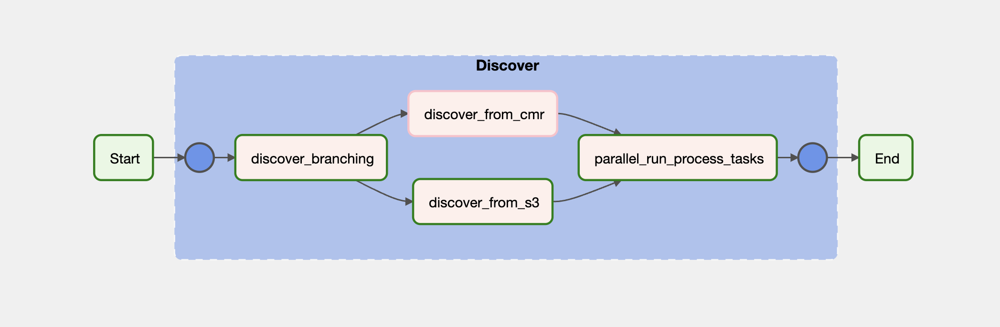

# Architecture

## Architecture Diagram

The following architecture diagram shows the **data transformation/ingestion pipeline**. Data can be discovered from CMR or from AWS S3. If the data needs to be converted into a cloud optimized geotiff, it's done in the cogification step. Then, it's uploaded to the official VEDA S3 bucket (if needed) and published to the STAC database and API.

## The architecture as Airflow DAG

The architecture defined above has been implemented as an Airflow DAG (specifically we are using MWAA other resources in AWS) and the pictures below show how they look in Airflow UI graph view.

### Discovery

### Ingest and Publish

